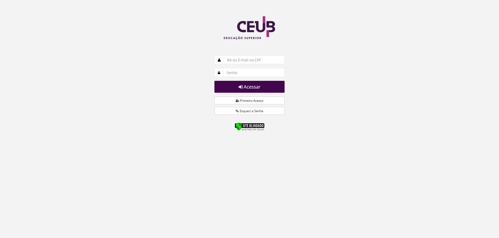
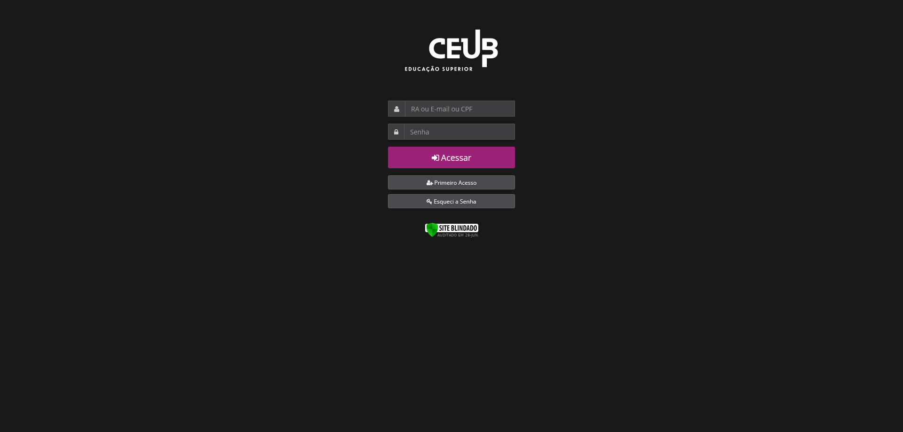
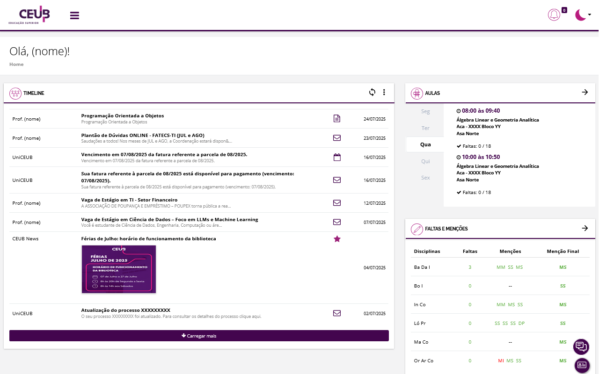
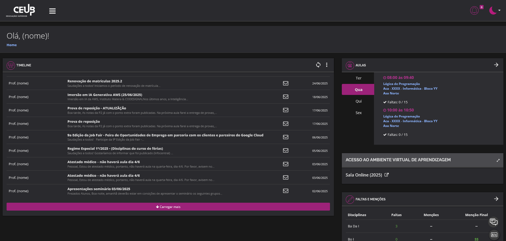
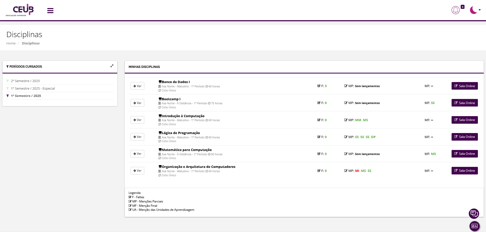
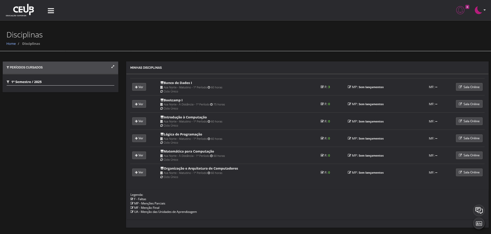

[🇬🇧 English Version](#english-version)

# 🌓 Modo Escuro - Espaço Aluno

[](https://github.com/Joaooh/modo-escuro-uniceub/releases)
[](https://addons.mozilla.org/pt-BR/firefox/addon/modo-escuro-espa%C3%A7o-aluno/)
[](https://chromewebstore.google.com/detail/modo-escuro-espa%C3%A7o-aluno/ccliokkicdfefeciihmheaffddcanhcb?hl=pt-BR)

Uma extensão de navegador que aplica um **modo escuro personalizado** ao site da **universidade UniCEUB**. Ideal para navegar sem cansar os olhos.

> ⚠️ Esta extensão não altera a funcionalidade da página — apenas seu estilo visual.

🛡️ **Política de Privacidade:** Confira o [PRIVACY.md](./PRIVACY.md) para saber como seus dados são tratados.

<br>

## 📷 Prévia

| Modo Escuro DESLIGADO | Modo Escuro LIGADO |
|-----------------------|---------------------|
|  |  |
|  |  |
|  |  |

<br>

## ✨ Funcionalidades

- Altera cores de fundo, texto e elementos principais do UniCEUB
- Mantém contraste e acessibilidade
- Ativado automaticamente nas páginas da universidade
- Leve: CSS injetado dinamicamente

<br>

## 🚀 Como Instalar

Você pode instalar a extensão usando os métodos abaixo, dependendo do navegador:

### 🦊 Para Mozilla Firefox

**Opção 1 (Recomendada):**

* Baixe diretamente pela [Firefox Add-ons](https://addons.mozilla.org/pt-BR/firefox/addon/modo-escuro-espa%C3%A7o-aluno/)!

[](https://addons.mozilla.org/pt-BR/firefox/addon/modo-escuro-espa%C3%A7o-aluno/)

> [!NOTE]
> Se a versão do Firefox for antiga, a própria página da extensão na loja mostrará uma mensagem informando que é necessário atualizar o navegador — o botão "Adicionar ao Firefox" será substituído por um aviso. Isso acontece porque, nos laboratórios da universidade, a versão instalada (em `C:\Program Files`) não é atualizada com frequência.

Para contornar isso:

* Acesse [mozilla.org/firefox](https://www.mozilla.org/pt-BR/firefox/new/)
* Baixe a versão mais recente
* Ao abrir o instalador, será exibida a tela de permissão de administrador. Clique em **Não**
* A instalação continuará normalmente sem exigir permissões administrativas
* Diretório do navegador atualizado: `C:\Usuários\SeuNome\AppData\Local\Mozilla Firefox`

**Opção 2 (Temporária):**
1. Baixe o arquivo `firefox.zip` mais recente na página de [Releases](https://github.com/Joaooh/modo-escuro-uniceub/releases) do projeto.
2. Extraia o arquivo baixado.
3. No Firefox, vá para `about:debugging#/runtime/this-firefox`.
4. Clique em **"Carregar extensão temporária..."**
5. Selecione o arquivo `manifest.json` da pasta da extensão.

> A extensão ficará ativa até o Firefox ser fechado.<br>
> Para uso permanente, prefira a Opção 1!

<br>

### 🌐 Para Google Chrome / Microsoft Edge

**Opção 1 (Recomendada):**
- Baixe diretamente pela [Chrome Web Store](https://chromewebstore.google.com/detail/modo-escuro-espa%C3%A7o-aluno/ccliokkicdfefeciihmheaffddcanhcb?hl=pt-BR)!

[](https://chromewebstore.google.com/detail/modo-escuro-espa%C3%A7o-aluno/ccliokkicdfefeciihmheaffddcanhcb?hl=pt-BR)

**Opção 2 (Modo desenvolvedor):**
1. Baixe o arquivo `chromium.zip` mais recente na página de [Releases](https://github.com/Joaooh/modo-escuro-uniceub/releases) do projeto.
2. Extraia o arquivo baixado.
3. No Chrome/Edge, vá até a página de extensões (por exemplo, `chrome://extensions`).
4. Certifique-se de que o "**Modo do desenvolvedor**" está ativado.
5. Clique em **"Carregar sem compactação"** e selecione a pasta da extensão (`chromium`).

<br>

## 🗂 Estrutura do Projeto

```
modo-escuro-uniceub/
├── manifest.json         # Configura a extensão, permissões e scripts.
├── background.js         # Script de fundo principal. Gerencia injeção de CSS e redirecionamento de ícones.
├── fix-styles.js         # Script que corrige estilos inline definidos diretamente via JavaScript.
├── styles/
│ └── dark-mode.css       # Estilos principais do tema escuro.
├── popup/
│ ├── popup.html          # HTML do popup.
│ ├── popup.css           # Estilo do popup.
│ └── popup.js            # Lógica do popup em JavaScript.
└── icons/                # Ícones da extensão para barra de ferramentas e loja.
```
> ⚙️ Nota: Para suportar navegadores Chromium, foi criado `chromium-fixes.css` e foram feitos ajustes no JS.

## 🛠 Tecnologias Utilizadas

- HTML
- CSS
- JavaScript

## 📌 Compatibilidade

| Navegador | Compatibilidade        |
|-----------|-------------------|
| Firefox   | ✅ Totalmente compatível |
| Chrome    | ✅ Totalmente compatível |
| Edge      | ✅ Totalmente compatível |

## 🧪 Contribuições

Sugestões de melhorias, novos estilos ou relatórios de bugs são bem-vindos. Basta abrir uma [Issue](https://github.com/Joaooh/modo-escuro-uniceub/issues) ou enviar um [Pull Request](https://github.com/Joaooh/modo-escuro-uniceub/pulls).

## 📄 Licença

Distribuído sob a licença **MIT**. Veja o arquivo `LICENSE` para mais informações.

---

### English Version

## 🌓 Dark Mode - Espaço Aluno

[](https://github.com/Joaooh/modo-escuro-uniceub/releases)
[](https://addons.mozilla.org/en-US/firefox/addon/modo-escuro-espa%C3%A7o-aluno/)
[](https://chromewebstore.google.com/detail/modo-escuro-espa%C3%A7o-aluno/ccliokkicdfefeciihmheaffddcanhcb?hl=en-US)

A browser extension that applies a **custom dark mode** to the **UniCEUB university website**. Ideal for browsing without straining your eyes.

> ⚠️ This extension does not alter the functionality of the page — only its visual style.

🛡️ **Privacy Policy:** Check [PRIVACY.md](./PRIVACY.md) for details on how your data is handled.

<br>

## 📷 Preview

| Dark Mode OFF | Dark Mode ON |
|--------|------------------------|
|  |  |
|  |  |
|  |  |

<br>

## ✨ Features

- Changes background, text, and main element colors of UniCEUB
- Maintains contrast and accessibility
- Automatically activates on university pages
- Lightweight: CSS injected dynamically

<br>

## 🚀 How to Install

You can install the extension using the following methods, depending on your browser:

### 🦊 For Mozilla Firefox

**Option 1 (Recommended):**

* Download it directly from the [Firefox Add-ons](https://addons.mozilla.org/en-US/firefox/addon/modo-escuro-espa%C3%A7o-aluno/) store!

[](https://addons.mozilla.org/en-US/firefox/addon/modo-escuro-espa%C3%A7o-aluno/)

> [!NOTE]
> If your Firefox version is outdated, the extension page on the store will display a message saying that an update is required — the "Add to Firefox" button will be replaced with a warning. This usually happens because the Firefox installation on university lab computers (located in `C:\Program Files`) is not frequently updated.

To bypass this limitation:

* Visit [mozilla.org/firefox](https://www.mozilla.org/en-US/firefox/new/)
* Download the latest version
* When the installer launches, a system prompt will ask for administrator permission. Click **No**
* Firefox will be installed normally in your user profile, without requiring administrative permissions
* Updated browser installation path: `C:\Users\YourName\AppData\Local\Mozilla Firefox`

**Option 2 (Temporary Load):**
1.  Download the latest `firefox.zip` file from the project's [Releases](https://github.com/Joaooh/modo-escuro-uniceub/releases) page.
2.  Unzip the file you just downloaded.
3.  Open Firefox and navigate to `about:debugging#/runtime/this-firefox`.
4.  Click **"Load Temporary Add-on..."**
5.  Select the `manifest.json` file from the extension folder.

> The extension will be active until Firefox is closed.<br>
> For permanent use, prefer Option 1!

<br>

### 🌐 For Google Chrome / Microsoft Edge

**Option 1 (Recommended):**
- Download it directly from the [Chrome Web Store](https://chromewebstore.google.com/detail/modo-escuro-espa%C3%A7o-aluno/ccliokkicdfefeciihmheaffddcanhcb?hl=en-US)!

[](https://chromewebstore.google.com/detail/modo-escuro-espa%C3%A7o-aluno/ccliokkicdfefeciihmheaffddcanhcb?hl=en-US)

**Option 2 (Developer Mode):**
1.  Download the latest `chromium.zip` file from the project's [Releases](https://github.com/Joaooh/modo-escuro-uniceub/releases) page.
2.  Unzip the file you just downloaded.
3.  Open Chrome/Edge and go to the extensions page (e.g., `chrome://extensions`).
4.  Ensure "**Developer mode**" is enabled.
5.  Click **"Load unpacked"** and select the extension folder (`chromium`).

<br>

## 🗂 Project Structure

```
modo-escuro-uniceub/
├── manifest.json         # Configures the extension, permissions, and scripts.
├── background.js         # Main background script. Handles CSS injection and icon redirection.
├── fix-styles.js         # Content script to fix hard-coded inline styles with JavaScript.
├── styles/
│   └── dark-mode.css     # The main stylesheet that applies the dark theme.
├── popup/
│   ├── popup.html        # The HTML for the popup window.
│   ├── popup.css         # The CSS for styling the popup.
│   └── popup.js          # The JavaScript that controls the popup's logic.
└── icons/                # Extension icons for the toolbar and store listing.
```
> ⚙️ Note: To support Chromium-based browsers, a `chromium-fixes.css` file and specific JS tweaks were added.  

## 🛠 Technologies Used

- HTML
- CSS
- JavaScript

## 📌 Compatibility

| Browser  | Compatibility |
|----------|------------|
| Firefox  | ✅ Fully compatible |
| Chrome   | ✅ Fully compatible |
| Edge     | ✅ Fully compatible |

## 🧪 Contributing

Suggestions for improvements, new styles, or bug reports are welcome. Just open an [Issue](https://github.com/Joaooh/modo-escuro-uniceub/issues) or submit a [Pull Request](https://github.com/Joaooh/modo-escuro-uniceub/pulls).

## 📄 License

Distributed under the **MIT** license. See `LICENSE` for more information.