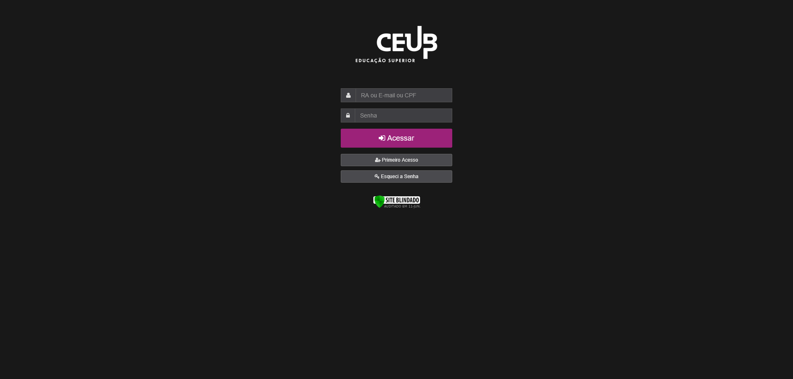

# 🌓 UniCEUB Dark Mode

A browser extension that applies a **custom dark mode** to the **UniCEUB university website**. Ideal for studying or browsing at night or for long periods without straining your eyes.

> ⚠️ This extension does not alter the functionality of the page — only its visual style.

---

## 📷 Preview

| Before | After (with Dark Mode) |
|--------|------------------------|
|  |  |
|  |  |
|  |  |

---

## ✨ Features

- Changes background, text, and main element colors of UniCEUB
- Maintains contrast and accessibility
- Automatically activates on university pages
- Lightweight: CSS injected dynamically

---

## 🚀 How to Install

You can install the extension using the following methods, depending on your browser:

### 🦊 For Mozilla Firefox

1.  Download the latest `firefox.zip` file directly from the project's [Releases](https://github.com/Joaooh/modo-escuro-uniceub/releases) page.
2.  Unzip the file you just downloaded.
3.  Open Firefox and navigate to `about:debugging#/runtime/this-firefox`.
4.  Click **"Load Temporary Add-on..."**
5.  Select the `manifest.json` file from the extension folder.

> The extension will be active until Firefox is closed.<br>
> For permanent use, wait for a possible future release on the Mozilla Add-ons store.

### 🌐 For Google Chrome / Microsoft Edge

1.  Download the latest `chromium.zip` file directly from the project's [Releases](https://github.com/Joaooh/modo-escuro-uniceub/releases) page.
2.  Unzip the file you just downloaded.
3.  Open Chrome/Edge and navigate to the extensions page (e.g., `chrome://extensions`).
4.  Ensure "**Developer mode**" is enabled.
4.  Click **"Load unpacked"** and select the extension's folder (`chrome`).

---

## 🗂 Project Structure

```
modo-escuro-uniceub/
├── manifest.json         # Configures the extension, permissions, and scripts.
├── background.js         # Main background script. Handles CSS injection and icon redirection.
├── fix-styles.js         # Content script to fix hard-coded inline styles with JavaScript.
├── styles/
│   └── dark-mode.css     # The main stylesheet that applies the dark theme.
├── popup/
│   ├── popup.html        # The HTML for the popup window.
│   ├── popup.css         # The CSS for styling the popup.
│   └── popup.js          # The JavaScript that controls the popup's logic.
└── icons/                # Extension icons for the toolbar and store listing.
```

---

## 🛠 Technologies Used

- HTML
- CSS
- JavaScript
- WebExtensions API (Firefox)

---

## 📌 Compatibility

| Browser  | Compatible |
|----------|------------|
| Firefox  | ✅ Fully compatible |
| Chrome   | ✅ Fully compatible |
| Edge     | ✅ Fully compatible |

---

## 🧪 Contributing

Suggestions for improvements, new styles, or bug reports are welcome. Just open an [Issue](https://github.com/Joaooh/modo-escuro-uniceub/issues) or submit a [Pull Request](https://github.com/Joaooh/modo-escuro-uniceub/pulls).

---

## 📄 License

Distributed under the **MIT** license. See `LICENSE` for more information.