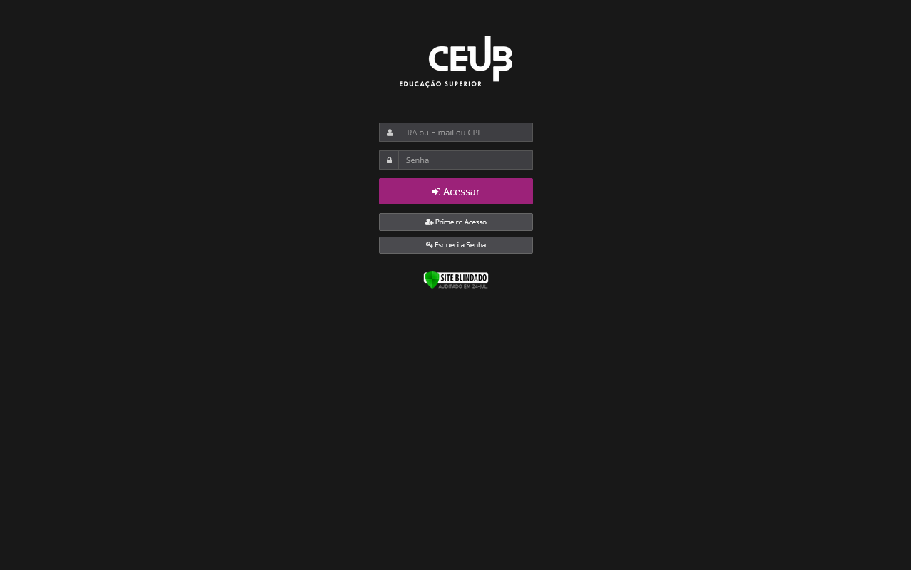

[🇬🇧 English Version](#english-version)

# 🌓 Modo Escuro - Espaço Aluno

[](https://github.com/Joaooh/modo-escuro-uniceub/releases)

Uma extensão de navegador que aplica um **modo escuro personalizado** ao site da **universidade UniCEUB**. Ideal para navegar sem cansar os olhos.

> ⚠️ Esta extensão não altera a funcionalidade da página — apenas seu estilo visual.

🛡️ **Política de Privacidade:** Confira o [PRIVACY.md](./PRIVACY.md) para saber como seus dados são tratados.

> [!IMPORTANT]  
> Este projeto foi incorporado oficialmente ao site do UniCEUB em **02/09/2025**. 🎉 
> A extensão foi removida das lojas do Chrome e Firefox 30 dias depois, mas este repositório segue ativo como referência e poderá receber atualizações pontuais.  
> A instalação ainda é possível via **modo temporário/desenvolvedor**.  
>
> Agradeço a todos pelo apoio e feedback!

<br>

## 📷 Prévia

| Modo Escuro DESLIGADO | Modo Escuro LIGADO |
|-----------------------|---------------------|
|  |  |
|  |  |
|  |  |

<br>

## ✨ Funcionalidades

- Altera cores de fundo, texto e elementos principais do UniCEUB
- Mantém contraste e acessibilidade
- Ativado automaticamente nas páginas da universidade
- Leve: CSS injetado dinamicamente

<br>

## 🚀 Como Instalar

Atualmente, a extensão não está mais disponível nas lojas oficiais (Chrome Web Store e Firefox Add-ons).  
A instalação pode ser feita apenas pelo método temporário/desenvolvedor:

### 🦊 Para Mozilla Firefox

1. Baixe o arquivo `firefox.zip` mais recente na página de [Releases](https://github.com/Joaooh/modo-escuro-uniceub/releases) do projeto.
2. Extraia o arquivo baixado.
3. No Firefox, vá para `about:debugging#/runtime/this-firefox`.
4. Clique em **"Carregar extensão temporária..."**
5. Selecione o arquivo `manifest.json` da pasta da extensão.

> A extensão ficará ativa até o Firefox ser fechado.<br>

<br>

### 🌐 Para Google Chrome / Microsoft Edge

1. Baixe o arquivo `chromium.zip` mais recente na página de [Releases](https://github.com/Joaooh/modo-escuro-uniceub/releases) do projeto.
2. Extraia o arquivo baixado.
3. No Chrome/Edge, vá até a página de extensões (por exemplo, `chrome://extensions`).
4. Certifique-se de que o "**Modo do desenvolvedor**" está ativado.
5. Clique em **"Carregar sem compactação"** e selecione a pasta da extensão (`chromium`).

<br>

## 🗂 Estrutura do Projeto

```
modo-escuro-uniceub/
├── manifest.json         # Configura a extensão, permissões e scripts.
├── background.js         # Script de fundo principal. Gerencia injeção de CSS e redirecionamento de ícones.
├── fix-styles.js         # Script que corrige estilos inline definidos diretamente via JavaScript.
├── styles/
│ └── dark-mode.css       # Estilos principais do tema escuro.
├── popup/
│ ├── popup.html          # HTML do popup.
│ ├── popup.css           # Estilo do popup.
│ └── popup.js            # Lógica do popup em JavaScript.
└── icons/                # Ícones da extensão para barra de ferramentas e loja.
```
> ⚙️ Nota: Para suportar navegadores Chromium, foi criado `chromium-fixes.css` e foram feitos ajustes no JS.

## 🛠 Tecnologias Utilizadas

- HTML
- CSS
- JavaScript

## 📌 Compatibilidade

| Navegador | Compatibilidade        |
|-----------|-------------------|
| Firefox   | ✅ Totalmente compatível |
| Chrome    | ✅ Totalmente compatível |
| Edge      | ✅ Totalmente compatível |

## 🧪 Contribuições

Sugestões de melhorias, novos estilos ou relatórios de bugs são bem-vindos. Basta abrir uma [Issue](https://github.com/Joaooh/modo-escuro-uniceub/issues) ou enviar um [Pull Request](https://github.com/Joaooh/modo-escuro-uniceub/pulls).

## 📄 Licença

Distribuído sob a licença **MIT**. Veja o arquivo `LICENSE` para mais informações.

---

### English Version

## 🌓 Dark Mode - Espaço Aluno

[](https://github.com/Joaooh/modo-escuro-uniceub/releases)

A browser extension that applies a **custom dark mode** to the **UniCEUB university website**. Ideal for browsing without straining your eyes.

> ⚠️ This extension does not alter the functionality of the page — only its visual style.

🛡️ **Privacy Policy:** Check [PRIVACY.md](./PRIVACY.md) for details on how your data is handled.

> [!IMPORTANT]  
> This project was officially integrated into the UniCEUB website on **09/02/2025**. 🎉 
> The extension was removed from the Chrome and Firefox stores 30 days later, but this repository remains active as a reference and may receive occasional updates.  
> Installation is still possible via **temporary/developer mode**.  
>
> Thank you all for the support and feedback!

<br>

## 📷 Preview

| Dark Mode OFF | Dark Mode ON |
|--------|------------------------|
|  |  |
|  |  |
|  |  |

<br>

## ✨ Features

- Changes background, text, and main element colors of UniCEUB
- Maintains contrast and accessibility
- Automatically activates on university pages
- Lightweight: CSS injected dynamically

<br>

## 🚀 How to Install

The extension is no longer available on the official stores (Chrome Web Store and Firefox Add-ons).  
It can now only be installed via the temporary/developer method:

### 🦊 For Mozilla Firefox

1.  Download the latest `firefox.zip` file from the project's [Releases](https://github.com/Joaooh/modo-escuro-uniceub/releases) page.
2.  Unzip the file you just downloaded.
3.  Open Firefox and navigate to `about:debugging#/runtime/this-firefox`.
4.  Click **"Load Temporary Add-on..."**
5.  Select the `manifest.json` file from the extension folder.

> The extension will be active until Firefox is closed.<br>

<br>

### 🌐 For Google Chrome / Microsoft Edge

1.  Download the latest `chromium.zip` file from the project's [Releases](https://github.com/Joaooh/modo-escuro-uniceub/releases) page.
2.  Unzip the file you just downloaded.
3.  Open Chrome/Edge and go to the extensions page (e.g., `chrome://extensions`).
4.  Ensure "**Developer mode**" is enabled.
5.  Click **"Load unpacked"** and select the extension folder (`chromium`).

<br>

## 🗂 Project Structure

```
modo-escuro-uniceub/
├── manifest.json         # Configures the extension, permissions, and scripts.
├── background.js         # Main background script. Handles CSS injection and icon redirection.
├── fix-styles.js         # Content script to fix hard-coded inline styles with JavaScript.
├── styles/
│   └── dark-mode.css     # The main stylesheet that applies the dark theme.
├── popup/
│   ├── popup.html        # The HTML for the popup window.
│   ├── popup.css         # The CSS for styling the popup.
│   └── popup.js          # The JavaScript that controls the popup's logic.
└── icons/                # Extension icons for the toolbar and store listing.
```
> ⚙️ Note: To support Chromium-based browsers, a `chromium-fixes.css` file and specific JS tweaks were added.  

## 🛠 Technologies Used

- HTML
- CSS
- JavaScript

## 📌 Compatibility

| Browser  | Compatibility |
|----------|------------|
| Firefox  | ✅ Fully compatible |
| Chrome   | ✅ Fully compatible |
| Edge     | ✅ Fully compatible |

## 🧪 Contributing

Suggestions for improvements, new styles, or bug reports are welcome. Just open an [Issue](https://github.com/Joaooh/modo-escuro-uniceub/issues) or submit a [Pull Request](https://github.com/Joaooh/modo-escuro-uniceub/pulls).

## 📄 License

Distributed under the **MIT** license. See `LICENSE` for more information.
